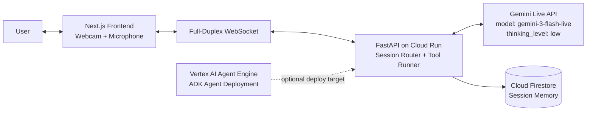

# Kinesis Live Agent Architecture

## Runtime flow
1. User speaks / shows camera frames in the browser.
2. Next.js streams chunked audio/video to FastAPI over WebSocket.
3. FastAPI opens a secure server-to-server Gemini Live session.
4. Gemini may return tool/function calls; backend executes tools and returns results.
5. Backend streams text/audio/video responses back to frontend in real time.
6. Firestore stores turn-level memory for session continuity and analytics.
